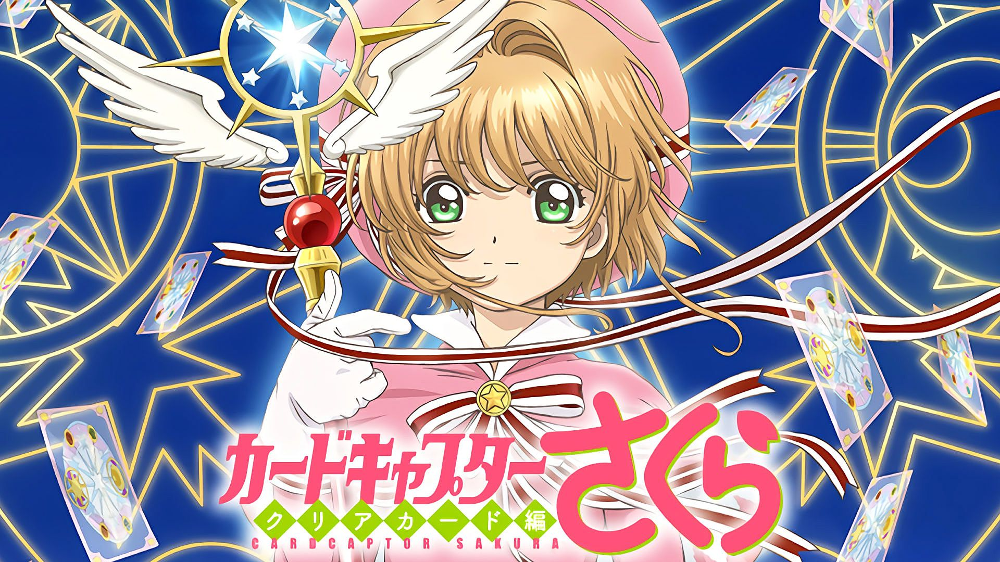

# Sakura CardCaptor API ✨



## This API (and it's readme) were highly inspired by the [sakura-card-captor-api](https://github.com/JessVel/sakura-card-captor-api).

The end of the Heroku free tier resulted in it's halt, so I decided to recreate it and host it as an AWS Lambda function. The data was scraped from the [Sakura Card Captor Fandom Page](https://ccsakura.fandom.com/) and the script used is included as well.

https://4gngurqord.execute-api.us-west-2.amazonaws.com/Prod/

| HTTP METHOD | GET             |
| ----------- | --------------- |
| cards       | gets all cards  |
| card        | gets card by id |

## /cards

This call will return a maximum of 52 cards. The default is 52.

-   Example of the response:

```json
[
  {
    "id": 1,
    "title": "The Arrow",
    "desc": "The Arrow is a Clow Card with the power to fire a volley of magic arrows. It is under The Firey under the power of the Sun, Cerberus, and Western Magic.",
    "clowCard": {
        "front": "https://static.wikia.nocookie.net/ccs/images/8/80/ClowArrow.jpg",
        "back": "https://static.wikia.nocookie.net/ccs/images/7/7b/CCS_Clow_Card.jpg"
    },
    "sakuraCard": {
        "front": "https://static.wikia.nocookie.net/ccs/images/a/a9/SakuraArrow.jpg",
        "back": "https://static.wikia.nocookie.net/ccs/images/3/3f/CCS_Sakura_Card.jpg"
    },
    "kanji": "矢",
    "katakana": "アロー",
    "sign": "Sun",
    "hierarchy": "The Firey",
    "magicType": "Western Magic",
    "temperament": "Aggressive"
  },
    { ... },
    { ... }
]

```

These are the supported query string parameters:

| Parameters | Description                                                             |
| ---------- | ----------------------------------------------------------------------- |
| page       | The page of data to access. Defaults to 1.                              |
| limit      | The maximum amount of cards to return. Defaults to 52 (max is also 52). |

Simple usage:

```bash
# Get all Cards
curl "https://4gngurqord.execute-api.us-west-2.amazonaws.com/Prod/cards"

# Get page 3 of data with a page size of 10 Cards
curl "https://4gngurqord.execute-api.us-west-2.amazonaws.com/Prod/cards?limit=10&page=3"
```

## /card

This call will return a single card (you need to specify it's id).

-   Example of object:

```json
{
	"id": 1,
	"title": "The Arrow",
	"desc": "The Arrow is a Clow Card with the power to fire a volley of magic arrows. It is under The Firey under the power of the Sun, Cerberus, and Western Magic.",
	"clowCard": {
		"front": "https://static.wikia.nocookie.net/ccs/images/8/80/ClowArrow.jpg",
		"back": "https://static.wikia.nocookie.net/ccs/images/7/7b/CCS_Clow_Card.jpg"
	},
	"sakuraCard": {
		"front": "https://static.wikia.nocookie.net/ccs/images/a/a9/SakuraArrow.jpg",
		"back": "https://static.wikia.nocookie.net/ccs/images/3/3f/CCS_Sakura_Card.jpg"
	},
	"kanji": "矢",
	"katakana": "アロー",
	"sign": "Sun",
	"hierarchy": "The Firey",
	"magicType": "Western Magic",
	"temperament": "Aggressive"
}
```

These are the supported query string parameters:

| Parameters | Description                |
| ---------- | -------------------------- |
| id         | **REQUIRED**. The card id. |

Simple usage:

```bash
# Get single card by id.
curl "https://4gngurqord.execute-api.us-west-2.amazonaws.com/Prod/card?id=1"
```

## ✨ There are currently 10 available resources:

`id`: Card id. <br>
`title`: Card name. (Currently only available in english)<br>
`clowCard`: Contains an object with urls for the front and back of the Clow Card<br>
`sakuraCard`: Contains an object with urls for the front and back of the Sakura Card<br>
`kanji`: Card name in logographic Japanese characters.<br>
`katakana`: The name of the card written in Japanese Katakana script.<br>
`sign`: The number of the manga chapter or anime episode in which the card first appeared. In the manga, the card's sign is represented by a symbol that appears on the card itself, while in the anime it is simply referred to as the "Card Number". <br>
`hierarchy`: The order in which the card was captured by the cardcaptor. The cards were captured in a specific order based on their magical strength, with the first card captured being the least powerful and the final card being the most powerful. <br>
`magicType`: The category of magic to which the card belongs. The cards in the series are based on various magical concepts and entities, such as elements, mythical creatures, and abstract concepts. <br>
`temperament` : The personality or nature of the card, which can vary greatly between cards. Some cards are friendly and cooperative, while others are mischievous or even hostile. The temperament of the card can affect how difficult it is to capture and how it behaves once captured.<br>

## 🚀 Start proyect

`npm install`

`npm start`

## 👥 Community

Contributions are welcome 💕
